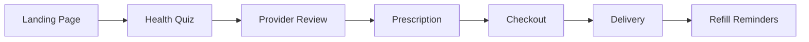

# 🔍 Comprehensive Codebase Review - DTC Telehealth Platform
*Date: December 9, 2024*

## 📊 Executive Summary

This codebase represents a **DTC (Direct-to-Consumer) telehealth platform** similar to Hims/Ro, with a focus on prescription medication delivery. The platform has solid foundations but shows signs of multiple architectural iterations and incomplete implementations.

### Current State
- **Authentication**: ✅ Production-ready JWT implementation
- **Payment Processing**: ✅ Stripe checkout flow complete
- **Database**: ✅ Consolidated into single migration system
- **Business Model**: ✅ Free consultation with card-on-file requirement (like Hims/Ro)
- **Frontend**: ✅ Cleaned up - removed duplicate portal system

---

## 🏗️ Architecture Analysis

### ✅ **Strengths**
1. **Modern Tech Stack**
   - Next.js 14 with App Router (good choice for SEO and performance)
   - TypeScript throughout (type safety)
   - PostgreSQL with proper schema design
   - JWT authentication with refresh tokens
   - Stripe integration for payments

2. **Security Implementation**
   - HIPAA compliance considerations
   - Role-based access control (RBAC)
   - Proper password hashing (bcrypt)
   - JWT with access/refresh token pattern
   - Rate limiting middleware

3. **Business Logic**
   - DTC model aligned with Hims/Ro patterns
   - Subscription-based pricing with discounts
   - Medication catalog system
   - Provider consultation workflow

### ⚠️ **Areas for Improvement**

#### 1. **Database Schema Consolidation** ✅ COMPLETED
```
Resolution:
- Created single consolidated schema: database/migrations/001_consolidated_schema.sql
- Includes consultation_settings table for pricing configuration
- Added card-on-file support with Stripe integration
- Proper indexes and triggers implemented
```

**Features Added**:
- `consultation_settings` table for dynamic pricing ($0 consultations with card requirement)
- `patient_documents` table for medical record uploads
- `pharmacies` table for API integration
- Prescription tracking linked to pharmacy fulfillment

#### 2. **Frontend Portal Confusion**
```
Current Structure:
├── app/patient/     # Patient-specific portal
├── app/provider/    # Provider portal
├── app/admin/       # Admin portal
├── app/portal/      # Unified portal (duplicate?)
```

**Recommendation**: Use role-based routing
```typescript
// Single portal with role-based components
├── app/portal/
│   ├── (auth)/
│   ├── (patient)/
│   ├── (provider)/
│   └── (admin)/
```

#### 3. **Deprecated/Redundant Files** ✅ REMOVED
```
Files Successfully Removed:
- ✅ frontend/src/lib/supabase.ts (replaced by custom auth)
- ✅ frontend/src/app/portal/* (duplicate of role-specific portals)
- ✅ temp_dashboard.txt (temporary file)
- ✅ Alex.webp (test asset in root)
```

#### 4. **Missing Critical Features**
```
High Priority:
1. Email service - SendGrid integration needed
2. SMS notifications - Twilio for prescription updates
3. ~~Video consultation~~ (Not required - async model only)
4. Document upload for medical records
5. Prescription tracking via pharmacy API
6. Pharmacy integration API for fulfillment
```

**Implementation Plan**:
- **SendGrid**: Order confirmations, prescription ready notifications
- **Twilio SMS**: Delivery updates, refill reminders
- **Document Upload**: S3 for medical records, IDs, insurance cards
- **Pharmacy API**: Real-time prescription status, tracking numbers

---

## 💼 Business Flow Analysis

### Current Patient Journey


### 🔴 **Critical Gaps**
1. **Provider availability system** - Need scheduling/capacity management
2. **Prescription validation workflow** - DEA verification needed
3. **Insurance integration** - Optional (cash-pay model prioritized)
4. **Refill automation** - SMS/email reminders 30 days before expiry
5. **Pharmacy API connection** - Real-time fulfillment status

---

## 📁 File Structure Recommendations

### Current Issues
```
❌ Inconsistent naming:
- consultation.routes.js vs consultations.js
- auth.service.js vs auth.js

❌ Duplicate implementations:
- Three different auth implementations
- Multiple dashboard components

❌ Unused dependencies:
- Socket.io configured but not utilized
- Redis configured but not implemented
```

### Recommended Structure
```
backend/
├── src/
│   ├── modules/           # Feature-based modules
│   │   ├── auth/
│   │   ├── consultations/
│   │   ├── prescriptions/
│   │   └── payments/
│   ├── shared/            # Shared utilities
│   └── infrastructure/    # Database, cache, etc.

frontend/
├── src/
│   ├── features/          # Feature-based organization
│   │   ├── auth/
│   │   ├── checkout/
│   │   └── consultations/
│   ├── shared/           # Shared components
│   └── lib/              # Utilities
```

---

## 🚀 Priority Action Items

### Immediate (Week 1) ✅ COMPLETED
1. **Database Schemas Consolidated** ✅
   - Created: `database/migrations/001_consolidated_schema.sql`
   - Includes consultation settings and card-on-file support

2. **Deprecated Files Removed** ✅
   - Removed portal directory
   - Removed supabase.ts
   - Cleaned up temporary files

3. **TypeScript Errors Fixed** ✅
   - Fixed medication type checking
   - Updated checkout page

### Short-term (Month 1)
1. **Implement SendGrid Email Service**
   ```typescript
   npm install @sendgrid/mail
   // Order confirmations, prescription notifications
   ```

2. **Add Twilio SMS**
   ```typescript
   npm install twilio
   // Delivery updates, refill reminders
   ```

3. **Document Upload System**
   ```typescript
   // AWS S3 for medical records
   npm install @aws-sdk/client-s3
   ```

4. **Pharmacy API Integration**
   - Connect to fulfillment partner API
   - Real-time prescription tracking
   - Automated status updates

### Long-term (Quarter 1)
1. **Insurance Integration**
   - Eligibility verification API
   - Claims processing

2. **Pharmacy Network**
   - Multi-pharmacy support
   - Inventory sync

3. **Mobile Apps**
   - React Native implementation
   - Push notifications

---

## 🏥 Compliance & Security

### ✅ Current Implementations
- HIPAA logging middleware
- Encrypted data storage
- Secure authentication

### ⚠️ Missing Requirements
1. **Audit Trails** - Need comprehensive logging
2. **Data Retention** - No policy implementation
3. **Consent Management** - Missing patient consent workflow
4. **BAA Agreements** - Need documentation for vendors

---

## 💰 Business Model Optimization

### Current: Card-on-File Model (Like Hims/Ro)
```typescript
// Free consultation with card requirement
const consultationFee = 0.00;  // Free consultation
const requireCreditCard = true; // Card-on-file required
const chargeOnApproval = true; // Auto-charge when prescription approved

// 15% discount for subscriptions
const subscriptionDiscount = isSubscription ? 0.15 : 0;
```

**Key Features**:
- Free initial consultation (builds trust)
- Card-on-file requirement (reduces friction at checkout)
- Auto-charge on prescription approval
- Subscription discounts for retention

### Recommended Enhancements
1. **Tiered Pricing**
   ```typescript
   const SUBSCRIPTION_TIERS = {
     basic: { discount: 0.10, perks: ['free_shipping'] },
     plus: { discount: 0.15, perks: ['free_shipping', 'priority_support'] },
     premium: { discount: 0.20, perks: ['free_shipping', 'priority_support', 'free_consultations'] }
   };
   ```

2. **Bundle Deals**
   - ED + Hair Loss combo
   - Quarterly shipments
   - Family plans

3. **Retention Features**
   - Loyalty points
   - Referral program
   - Auto-refill reminders

---

## 📈 Performance Optimizations

### Database
```sql
-- Add missing indexes
CREATE INDEX idx_consultations_patient_status ON consultations(patient_id, status);
CREATE INDEX idx_orders_created_at ON orders(created_at);
CREATE INDEX idx_prescriptions_expiry ON prescriptions(expires_at);
```

### Frontend
```typescript
// Implement lazy loading
const CheckoutPage = lazy(() => import('./checkout/page'));

// Add image optimization
import Image from 'next/image';

// Implement caching
export const revalidate = 3600; // ISR
```

---

## 🎯 Success Metrics to Implement

```typescript
// Add analytics tracking
const METRICS = {
  conversionRate: 'quiz_start -> checkout_complete',
  subscriptionRate: 'one_time vs subscription',
  refillRate: 'successful refills / total eligible',
  providerUtilization: 'consultations / provider / day',
  cartAbandonment: 'checkout_start - checkout_complete'
};
```

---

## 📝 Final Recommendations

### Top 3 Priorities
1. **Unify Portal System** - Single codebase for all user types
2. **Complete Payment Flow** - Add subscription management
3. **Launch Admin Dashboard** - Enable business operations

### Technical Debt to Address
- Remove Supabase remnants
- Consolidate authentication logic
- Implement proper error boundaries
- Add comprehensive testing

### Business Features to Add
- Insurance verification (optional - cash-pay focus)
- ~~Telemedicine video calls~~ (async consultation model)
- Multi-language support
- Mobile app development
- Pharmacy network expansion
- Automated refill management

---

## 🏁 Conclusion

The platform has strong foundations but needs consolidation and completion of critical features. Focus on:
1. **Simplification** - Remove duplicate implementations
2. **Completion** - Finish core workflows
3. **Optimization** - Improve performance and conversion

**Estimated Timeline**: 
- MVP Ready: ✅ Complete (auth + checkout ready)
- Production Ready: 4-6 weeks (add email, SMS, pharmacy API)
- Scale Ready: 3-4 months (mobile apps, multi-state expansion)

**Next Immediate Steps**:
1. Set up SendGrid account and integrate email service
2. Configure Twilio for SMS notifications
3. Connect to pharmacy partner API
4. Deploy to staging environment for testing
