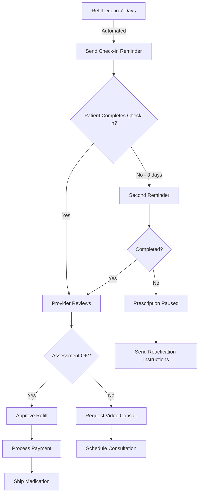

# DTC Telehealth Refill Check-in System

## How Leading DTC Companies Handle Prescription Refills

### 🏥 Industry Standards

**Major DTC Players & Their Approaches:**

1. **Hims/Hers**
   - Monthly check-ins for controlled substances
   - Quarterly check-ins for non-controlled medications
   - Simple questionnaire about side effects, efficacy, and changes
   - Auto-reminder emails/SMS 7 days before refill

2. **Ro (Roman)**
   - "Continuous care" model with periodic check-ins
   - Frequency based on medication type (monthly for ED, quarterly for hair loss)
   - Photo progress tracking for dermatology
   - Provider reviews all check-ins within 24 hours

3. **Curology**
   - Monthly progress photos required
   - Skin assessment questionnaire
   - Provider adjusts formulation based on progress
   - Automatic pause if check-in missed

4. **Keeps**
   - Quarterly check-ins for hair loss medications
   - Progress photos + questionnaire
   - Dose adjustments based on results and side effects

---

## 📋 Check-in Requirements by Medication Type

| Medication Category | Check-in Frequency | Requirements |
|-------------------|-------------------|--------------|
| **Controlled Substances** (Testosterone, ADHD meds) | Monthly | Full assessment, ID verification, provider review |
| **Weight Loss** (Semaglutide, Phentermine) | Monthly | Weight log, side effects, diet/exercise review |
| **ED Medications** (Sildenafil, Tadalafil) | Quarterly | Efficacy check, cardiovascular review |
| **Hair Loss** (Finasteride, Minoxidil) | Quarterly | Progress photos, side effects |
| **Skincare** (Tretinoin) | Monthly first 3 months, then quarterly | Photos, irritation assessment |
| **Mental Health** (SSRIs) | Monthly | Mood assessment, side effects, suicidal ideation screening |

---

## 🔄 The Refill Check-in Flow



---

## 💡 Key Features of Check-in System

### 1. **Smart Questionnaires**
- Dynamic questions based on medication and previous responses
- Red flag detection (severe side effects auto-escalate to provider)
- Progress tracking with visual charts
- Adaptive frequency (stable patients → less frequent)

### 2. **Compliance Enforcement**
```javascript
// No check-in = No refill
if (daysSinceLastCheckIn > medication.checkInIntervalDays) {
  prescription.status = 'REQUIRES_CHECKIN';
  prescription.canRefill = false;
}
```

### 3. **Provider Efficiency**
- Bulk review interface for providers
- Auto-approval for stable patients with no issues
- Flag system for cases needing attention
- Template responses for common scenarios

### 4. **Patient Experience**
- Takes 2-3 minutes to complete
- Mobile-optimized
- Save progress and return later
- Clear explanation of why it's required

---

## 📊 Check-in Form Structure

### Core Questions (All Medications):
1. **Are you still taking this medication as prescribed?**
2. **Have you experienced any side effects?** (with severity scale)
3. **How effective has the medication been?** (1-10 scale)
4. **Any changes to your health since last check-in?**
5. **New medications started?**
6. **Questions for your provider?**

### Medication-Specific Additions:

**Weight Loss:**
- Current weight
- Weekly weight log
- Diet adherence (1-10)
- Exercise frequency
- GI side effects checklist
- Photos (optional but encouraged)

**Hair Loss:**
- Progress photos (required)
- Shedding assessment
- Sexual side effects screening
- Mood changes

**ED Medications:**
- Efficacy rating
- Cardiovascular symptoms
- Chest pain/dizziness check
- Nitrate medication check

**Skincare:**
- Photos (required)
- Irritation level (0-10)
- Peeling/redness areas
- Sun exposure habits

---

## 🚨 Automatic Escalation Triggers

These responses trigger immediate provider review:

- Chest pain (ED meds)
- Suicidal thoughts (mental health)
- Severe nausea/vomiting (weight loss)
- Vision changes (ED meds)
- Severe mood changes (hormone therapy)
- Allergic reactions (any medication)
- Hospitalization since last check-in
- Pregnancy (most medications)

---

## 📱 Implementation in Our System

### Database Schema Addition:

```sql
-- Check-in templates for different medication types
CREATE TABLE checkin_templates (
    id UUID PRIMARY KEY DEFAULT uuid_generate_v4(),
    medication_category VARCHAR(100) NOT NULL,
    frequency_days INTEGER NOT NULL,
    questions JSONB NOT NULL,
    escalation_triggers JSONB,
    created_at TIMESTAMP DEFAULT NOW()
);

-- Patient check-in responses
CREATE TABLE refill_checkins (
    id UUID PRIMARY KEY DEFAULT uuid_generate_v4(),
    prescription_id UUID REFERENCES prescriptions(id),
    patient_id UUID REFERENCES patients(id),
    provider_id UUID REFERENCES providers(id),
    
    -- Check-in data
    responses JSONB NOT NULL,
    weight_log JSONB,
    photos_urls TEXT[],
    
    -- Status
    status VARCHAR(50) DEFAULT 'pending_review', -- pending_review, approved, requires_consultation, expired
    provider_notes TEXT,
    
    -- Flags
    has_side_effects BOOLEAN DEFAULT false,
    has_red_flags BOOLEAN DEFAULT false,
    auto_escalated BOOLEAN DEFAULT false,
    
    -- Timestamps
    submitted_at TIMESTAMP DEFAULT NOW(),
    reviewed_at TIMESTAMP,
    approved_at TIMESTAMP,
    expires_at TIMESTAMP, -- Check-in validity period
    
    created_at TIMESTAMP DEFAULT NOW()
);

-- Refill requests
CREATE TABLE refill_requests (
    id UUID PRIMARY KEY DEFAULT uuid_generate_v4(),
    prescription_id UUID REFERENCES prescriptions(id),
    checkin_id UUID REFERENCES refill_checkins(id),
    patient_id UUID REFERENCES patients(id),
    
    status VARCHAR(50) DEFAULT 'pending', -- pending, approved, denied, requires_checkin
    denial_reason TEXT,
    
    requested_at TIMESTAMP DEFAULT NOW(),
    processed_at TIMESTAMP
);

-- Add to prescriptions table
ALTER TABLE prescriptions ADD COLUMN checkin_frequency_days INTEGER DEFAULT 30;
ALTER TABLE prescriptions ADD COLUMN last_checkin_date DATE;
ALTER TABLE prescriptions ADD COLUMN next_checkin_due DATE;
ALTER TABLE prescriptions ADD COLUMN checkins_completed INTEGER DEFAULT 0;
ALTER TABLE prescriptions ADD COLUMN can_refill BOOLEAN DEFAULT true;
```

### Check-in Enforcement Logic:

```typescript
// Backend: Check if refill allowed
async function canRefillPrescription(prescriptionId: string): Promise<boolean> {
  const prescription = await db.prescriptions.findById(prescriptionId);
  
  // Check if check-in required
  const daysSinceLastCheckin = daysBetween(prescription.last_checkin_date, new Date());
  
  if (daysSinceLastCheckin > prescription.checkin_frequency_days) {
    return false; // Requires check-in
  }
  
  // Check if has remaining refills
  if (prescription.refills_remaining <= 0) {
    return false; // Needs new prescription
  }
  
  // Check if prescription expired
  if (prescription.expiration_date < new Date()) {
    return false; // Expired
  }
  
  return true;
}
```

### Automated Reminders:

```typescript
// Cron job to send check-in reminders
async function sendCheckinReminders() {
  const upcomingCheckins = await db.query(`
    SELECT p.*, pat.email, pat.phone, pat.first_name
    FROM prescriptions p
    JOIN patients pat ON p.patient_id = pat.id
    WHERE p.status = 'active'
    AND p.next_checkin_due <= CURRENT_DATE + INTERVAL '7 days'
    AND p.next_checkin_due >= CURRENT_DATE
    AND NOT EXISTS (
      SELECT 1 FROM refill_checkins rc 
      WHERE rc.prescription_id = p.id 
      AND rc.submitted_at > CURRENT_DATE - INTERVAL '7 days'
    )
  `);
  
  for (const prescription of upcomingCheckins) {
    await sendEmail({
      to: prescription.email,
      subject: 'Time for your monthly check-in',
      template: 'refill-checkin-reminder',
      data: {
        name: prescription.first_name,
        medication: prescription.medication_name,
        daysUntilDue: daysBetween(new Date(), prescription.next_checkin_due),
        checkinUrl: `${BASE_URL}/patient/checkin/${prescription.id}`
      }
    });
    
    await sendSMS({
      to: prescription.phone,
      message: `Hi ${prescription.first_name}, your ${prescription.medication_name} check-in is due in ${daysUntilDue} days. Complete it here: ${SHORT_URL}/${prescription.id}`
    });
  }
}
```

---

## 🎯 Best Practices from DTC Leaders

1. **Make it Frictionless**
   - Pre-fill known information
   - Save partial progress
   - Mobile-first design
   - Clear progress indicators

2. **Incentivize Completion**
   - "Complete check-in for free shipping"
   - "Earn points for on-time check-ins"
   - "Skip next month's check-in with 3 consecutive completions"

3. **Educational Approach**
   - Explain why check-ins are required
   - Show progress graphs
   - Celebrate milestones
   - Provide tips based on responses

4. **Smart Defaults**
   - Most common medications: Quarterly check-ins
   - New patients: Monthly for first 3 months
   - Stable patients: Can extend to 6 months
   - High-risk meds: Always monthly

5. **Provider Workflows**
   - Batch review interface
   - Auto-approval rules for stable patients
   - Quick actions (approve, request labs, schedule call)
   - Template messages for common scenarios

---

## 📈 Metrics to Track

- **Compliance Rate**: % of patients completing check-ins on time
- **Provider Review Time**: Average time to review check-in
- **Escalation Rate**: % requiring provider intervention
- **Abandonment Rate**: % starting but not completing
- **Refill Conversion**: % of check-ins leading to refill

---

## 🔒 Regulatory Compliance

**FDA Requirements:**
- Must establish valid patient-provider relationship
- Ongoing monitoring for controlled substances
- Documentation of medical necessity

**State Requirements:**
- Some states require video check-ins annually
- Varies by medication class
- Must verify patient location

**DEA Requirements (for controlled substances):**
- Monthly check-ins mandatory
- Identity verification required
- Must document legitimate medical purpose

---

## 💰 Business Impact

- **Reduces liability**: Documented ongoing care
- **Improves outcomes**: Better medication adherence
- **Increases LTV**: Regular touchpoints = higher retention
- **Enables upsells**: "Based on your check-in, consider adding..."
- **Builds trust**: Shows genuine care for patient wellbeing
