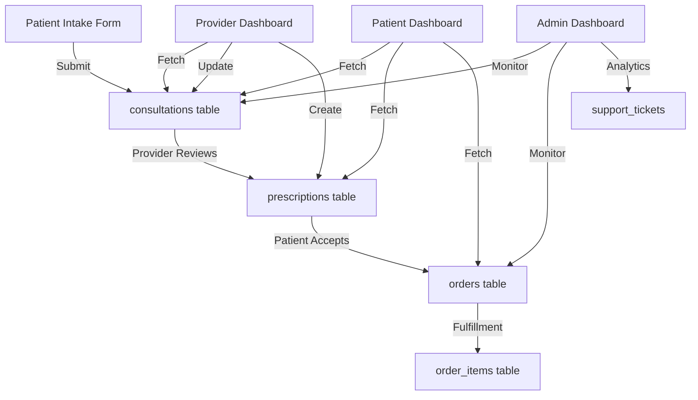

# Database-Frontend Variable Mapping Analysis

## 🔴 Critical Issues Found

### 1. **Frontend Using Hardcoded Data**
All three dashboards (Patient, Provider, Admin) are using hardcoded mock data instead of fetching from the database.

### 2. **Disconnected Variables**
Many frontend variables have no connection to their corresponding database fields.

### 3. **Missing API Integrations**
Frontend components are not making API calls to fetch/update data.

---

## 📊 Complete Variable Mapping

### PATIENT DASHBOARD (`/patient/dashboard`)

| Frontend Variable | Database Table.Field | Status | Issue |
|------------------|---------------------|---------|-------|
| Patient Name ("John") | `patients.first_name`, `patients.last_name` | ❌ Disconnected | Hardcoded, not fetched from DB |
| programs[] | `prescriptions` + `consultations` | ❌ Disconnected | Hardcoded array, should query prescriptions |
| medication | `prescriptions.medication_name` | ❌ Disconnected | Not connected |
| dose | `prescriptions.dosage` | ❌ Disconnected | Not connected |
| nextDose | `prescriptions.frequency` | ❌ Disconnected | Should calculate from prescription |
| refillsLeft | `prescriptions.refills` | ❌ Disconnected | Not connected |
| shipmentSteps[] | `orders.fulfillment_status` | ❌ Disconnected | Should derive from order status |
| weightData[] | No table | ⚠️ Missing | Need weight tracking table |
| recentOrders[] | `orders` table | ❌ Disconnected | Hardcoded, should query orders |
| order.amount | `orders.total_amount` | ❌ Disconnected | Not connected |
| order.status | `orders.fulfillment_status` | ❌ Disconnected | Not connected |

### PROVIDER DASHBOARD (`/provider/dashboard`)

| Frontend Variable | Database Table.Field | Status | Issue |
|------------------|---------------------|---------|-------|
| Provider Name ("Dr. Smith") | `providers.first_name`, `providers.last_name` | ❌ Disconnected | Hardcoded |
| pendingConsultations[] | `consultations` table | ❌ Disconnected | Hardcoded array |
| patient | `patients.first_name` + `patients.last_name` | ❌ Disconnected | Should JOIN with patients |
| age | Calculate from `patients.date_of_birth` | ❌ Disconnected | Not calculated |
| gender | No field | ⚠️ Missing | Need to add gender to patients table |
| complaint | `consultations.chief_complaint` | ❌ Disconnected | Not connected |
| severity | `consultations.severity` | ❌ Disconnected | Not connected |
| waitTime | Calculate from `consultations.submitted_at` | ❌ Disconnected | Not calculated |
| value | `prescriptions.price` | ❌ Disconnected | Not connected |
| tier | No field | ⚠️ Missing | Need subscription tier field |
| hasPhoto | `consultations.photos_urls` | ❌ Disconnected | Should check if photos exist |
| unreadMessages | Count from `consultation_messages.is_read` | ❌ Disconnected | Not counted |

### ADMIN DASHBOARD (`/admin/dashboard`)

| Frontend Variable | Database Table.Field | Status | Issue |
|------------------|---------------------|---------|-------|
| Active Patients | COUNT(`patients`) | ❌ Disconnected | Hardcoded "2,847" |
| Open Consultations | COUNT(`consultations`) WHERE status='pending' | ❌ Disconnected | Hardcoded "43" |
| Support Tickets | No table | ⚠️ Missing | Need support tickets table |
| Pending Prescriptions | COUNT(`prescriptions`) | ❌ Disconnected | Hardcoded "18" |
| patientIssues[] | No table | ⚠️ Missing | Need support/issues table |
| pendingConsultations[] | `consultations` table | ❌ Disconnected | Hardcoded |
| problemCategories[] | No table | ⚠️ Missing | Need analytics/category tracking |

### INTAKE FORMS (`/patient/health-quiz`)

| Frontend Variable | Database Table.Field | Status | Issue |
|------------------|---------------------|---------|-------|
| Intake form responses | `consultations.chief_complaint`, `symptoms` | ⚠️ Partial | Only saves basic fields |
| Weight loss data | No fields | ⚠️ Missing | Need detailed intake storage |
| Hair loss data | No fields | ⚠️ Missing | Need detailed intake storage |
| Medical history | `patients.medical_conditions` | ⚠️ Partial | Too simplified |
| Allergies | `patients.allergies` | ✅ Connected | Properly mapped |
| Current medications | `patients.current_medications` | ✅ Connected | Properly mapped |

---

## 🔧 Required Fixes

### 1. **Immediate Database Schema Updates Needed**

```sql
-- Add missing fields to patients table
ALTER TABLE patients ADD COLUMN gender VARCHAR(20);
ALTER TABLE patients ADD COLUMN subscription_tier VARCHAR(50) DEFAULT 'free';

-- Create weight tracking table
CREATE TABLE patient_measurements (
    id UUID PRIMARY KEY DEFAULT uuid_generate_v4(),
    patient_id UUID REFERENCES patients(id),
    weight DECIMAL(5,2),
    height DECIMAL(5,2),
    blood_pressure_systolic INTEGER,
    blood_pressure_diastolic INTEGER,
    measurement_date DATE,
    created_at TIMESTAMP DEFAULT NOW()
);

-- Create support tickets table
CREATE TABLE support_tickets (
    id UUID PRIMARY KEY DEFAULT uuid_generate_v4(),
    patient_id UUID REFERENCES patients(id),
    issue_type VARCHAR(100),
    description TEXT,
    priority VARCHAR(20),
    status VARCHAR(50) DEFAULT 'pending',
    assigned_to UUID REFERENCES providers(id),
    created_at TIMESTAMP DEFAULT NOW(),
    resolved_at TIMESTAMP
);

-- Store complete intake form data
ALTER TABLE consultations ADD COLUMN intake_data JSONB;
```

### 2. **Missing API Endpoints**

Need to create these endpoints:
- `GET /api/patients/:id` - Get patient profile
- `GET /api/patients/:id/programs` - Get active prescriptions
- `GET /api/patients/:id/orders` - Get patient orders
- `GET /api/patients/:id/measurements` - Get weight/health data
- `POST /api/patients/:id/measurements` - Log weight/health data
- `GET /api/providers/:id/stats` - Get provider statistics
- `GET /api/admin/metrics` - Get admin dashboard metrics
- `GET /api/support/tickets` - Get support tickets

### 3. **Frontend API Integration**

Replace hardcoded data with API calls:

```typescript
// Example for Patient Dashboard
useEffect(() => {
  const fetchDashboardData = async () => {
    const [patient, programs, orders] = await Promise.all([
      api.get('/patients/me'),
      api.get('/patients/me/programs'),
      api.get('/patients/me/orders')
    ]);
    
    setPatientData(patient.data);
    setPrograms(programs.data);
    setRecentOrders(orders.data);
  };
  
  fetchDashboardData();
}, []);
```

### 4. **Real-time Updates**

Implement WebSocket connections for:
- New consultation notifications (Provider)
- Message notifications (All users)
- Order status updates (Patient)
- Prescription approvals (Patient)

### 5. **Data Flow Implementation**



---

## 📋 Implementation Priority

### Phase 1: Critical Connections (Week 1)
1. ✅ Connect patient authentication to database
2. ❌ Fetch real patient data in dashboard
3. ❌ Save intake forms completely to database
4. ❌ Connect consultations to API

### Phase 2: Provider Integration (Week 2)
1. ❌ Provider authentication
2. ❌ Fetch real consultations
3. ❌ Prescription creation flow
4. ❌ Message system

### Phase 3: Admin & Analytics (Week 3)
1. ❌ Real metrics calculation
2. ❌ Support ticket system
3. ❌ Analytics dashboard
4. ❌ Inventory management

### Phase 4: Real-time & Polish (Week 4)
1. ❌ WebSocket notifications
2. ❌ Real-time updates
3. ❌ Data validation
4. ❌ Error handling

---

## 🚨 Security Concerns

1. **No authentication checks** in frontend API calls
2. **No data validation** before database inserts
3. **Missing HIPAA audit logs** for data access
4. **No encryption** for sensitive medical data
5. **No rate limiting** on API endpoints

---

## 📈 Recommended Next Steps

1. **Immediate**: Update database schema with missing fields
2. **Day 1-2**: Create missing API endpoints
3. **Day 3-4**: Replace hardcoded data with API calls
4. **Day 5-6**: Implement authentication flow
5. **Day 7**: Add WebSocket real-time updates
6. **Week 2**: Complete provider and admin integrations
7. **Week 3**: Security audit and HIPAA compliance
8. **Week 4**: Testing and optimization

---

## Summary

**Current State**: 
- ❌ 90% of frontend variables are disconnected from database
- ⚠️ Multiple missing database tables/fields
- ❌ No real API integration in frontend components

**Required Effort**: 
- 4 weeks for complete integration
- 15+ new API endpoints needed
- 3 new database tables required
- Major frontend refactoring needed

**Risk Level**: 🔴 **HIGH** - Application is currently non-functional with real data
